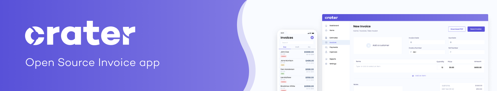

# Crater CI/CD pipeline

Deploy Crater server with CI/CD on Elestio

 
 

# Once deployed ...

You can open Crater UI here:

    URL: https://[CI_CD_DOMAIN]

You can open PHPMyAdmin web UI here:

    URL: https://[CI_CD_DOMAIN]:11860
    email: pixelfed
    password: [ADMIN_PASSWORD]

# First use

For your first use, you'll have to configure your Crater's instance:

- Click on `Check Requirements` button, then on `Continue` button twice.
- On `Site URL & Database` section, add/modify these credentials, don't touch of the others:

        Database Username: root
        Database Host: db
        Database Name: crater
        Database Password: [ADMIN_PASSWORD]

- On `Domain Verification` click on `Verify Now` button
- For `Mail Configuration` section, enter your own credentials depending on your
- For the other sections, enter your own informations
